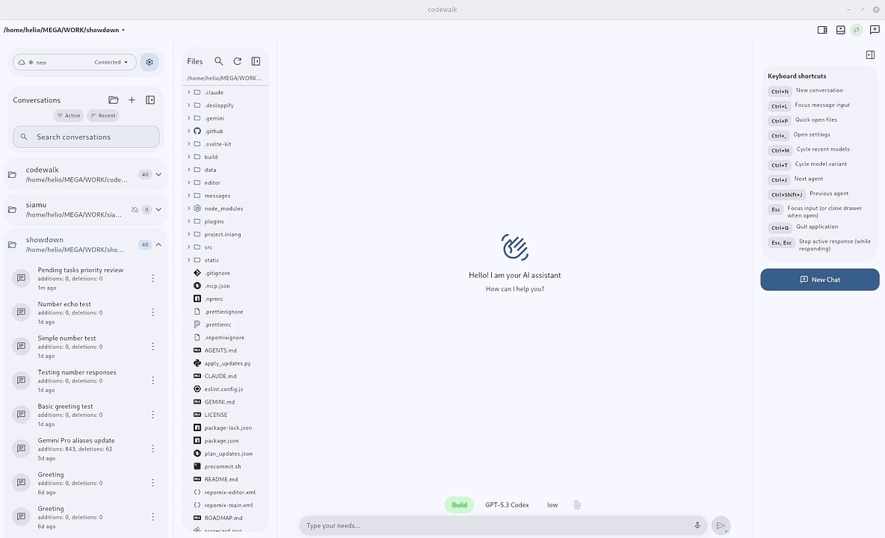

# CodeWalk

<p align="center"></p>
<p align="center">https://github.com/user-attachments/assets/032f64e2-e8ee-4024-b49a-ca95a774653f</p>


A native (really fast!!) cross-platform client for [OpenCode](https://github.com/anomalyco/opencode) server mode. Built with Flutter, it provides a conversational interface for session-based AI coding interactions over HTTP APIs and streaming events.

> 🏷️ **New in v1.244.0:** Assistant replies now render basic HTML formatting and native progress bars. [See supported tags and examples](#basic-html-in-assistant-replies).

> 📰 **New:** CodeWalk now runs right in your browser — open https://codewalk.verseles.com, add your OpenCode server profile, and start chatting. No install needed.
>
> Your OpenCode server must allow the web origin, otherwise the browser blocks the connection:
>
> ```bash
> opencode serve --cors "https://codewalk.verseles.com"
> ```

## Features

- 🌐 Fully translated into 14 languages: English, Português (Brasil), Español, Deutsch, Français, Italiano, Русский, 中文, 日本語, 한국어, हिन्दी, বাংলা, العربية, اردو — with instant switching, system-default detection, and RTL layout for Arabic and Urdu
- 💬 Realtime AI chat with streaming responses, older-history loading, and instant session reopen from cache
- 🗂 Project-centric sidebar with conversations grouped by project, pinning, and support for Git repositories and plain folders
- 🖧 Multi-server profiles with health checks, active-server switching, and OpenCode server install and launch from Settings
- 🧠 Model and provider selection with variants, favorites, and reasoning controls
- 🗃 Session tabs across the top of the window, browser-style, integrated into the title bar on desktop
- 📁 Built-in file manager and editor — browse, open, rename, duplicate and edit project files, with autosave, undo and redo, and syntax highlighting for every language the highlighter ships with
- 📎 Attach images and PDFs by dragging them in or pasting them, including screenshots straight from the clipboard
- ↪️ Forward a message to one or more other sessions
- 🧱 Block render mode — see each block as it finishes instead of watching text stream character by character
- 📉 Context usage metrics, so you can see how much of the window a session is consuming
- 🎨 Per-project icons discovered automatically from the repository, with matching session-tab colors you can disable in Appearance
- 📶 Data saver that scales back background sync on cellular
- 🖥 Server-hosted PTY terminal — a real command line running on the OpenCode host, embedded in the app
- 🎙 Speech-to-text on every platform, including Linux
- 🔊 Text-to-speech read-aloud for assistant messages, with adjustable speed and pitch
- 📊 Host quota monitoring for Claude, OpenRouter, Codex/OpenAI, Gemini, GitHub Copilot, OpenCode Go, NanoGPT, Wafer, Kimi, ZhipuAI, MiniMax, z.ai, Cursor, and Ollama Cloud
- 📈 Mermaid diagrams and LaTeX math rendered inline, straight from the conversation
- 🏷️ [Basic HTML in assistant replies](#basic-html-in-assistant-replies) — bold, italic, underline, line breaks, subscript/superscript, and native `<progress>` bars that follow the app theme
- 📤 Share any message as a themed image, or export a whole session as Markdown or JSON
- ↩️ Revert to any earlier turn, with your draft restored
- 💬 Canned answers with global or per-project scope
- ⌨️ Keyboard-first on desktop, including Alt+Tab-style session cycling
- 🔐 Cloudflare Access OAuth with PKCE, for servers behind an enterprise reverse proxy
- 🔔 Interactive permission and question prompts, with notifications that clear themselves when the answer arrives
- 🔄 In-app updates with auto-check and direct install
- 📱 Responsive Material 3 across Linux, Windows, macOS, Web, and Android, with five density tiers

## Basic HTML in Assistant Replies

<details>
<summary>Supported tags and examples</summary>

Assistant replies can mix these case-insensitive HTML tags with Markdown. Formatting and progress bars follow the app theme on mobile and desktop.

| Tag | Effect | Example |
| --- | --- | --- |
| `<b>` | Bold | `<b>Important</b>` |
| `<i>` | Italic | `<i>Note</i>` |
| `<u>` | Underline | `<u>Highlighted</u>` |
| `<br>` | Line break; `<br/>` and `<br />` also work | `First line<br>Second line` |
| `<sub>` | Subscript | `H<sub>2</sub>O` |
| `<sup>` | Superscript | `x<sup>2</sup>` |
| `<progress>` | Native progress bar | `<progress value="25" max="100">Loading</progress>` |

Formatting tags can nest, for example `<b><i>Bold and italic</i></b>`. Progress defaults to `max="1"`; omit `value` for an indeterminate bar, such as `<progress></progress>`. Explicitly self-closing progress tags also work.

Tags inside code examples stay literal, and copying the whole message preserves its source markup. Underline/subscript/superscript decoration is omitted in Markdown link labels to keep links clickable. Support is limited to the tags above; arbitrary HTML and CSS are not rendered.

</details>

## Install in One Command

Install using the `install.cat` pattern:

- Linux & macOS

  ```bash
  curl -fsSL install.cat/verseles/codewalk | sh
  ```

- Windows (PowerShell)

  ```powershell
  irm install.cat/verseles/codewalk | iex
  ```

Run the same command again any time to update/reinstall to the latest GitHub release.

Installers automatically pick the right release for your platform.

On Linux, release files are installed under
`${XDG_DATA_HOME:-$HOME/.local/share}/codewalk-app`, separately from user data.
Existing installations keep their preferences and caches in the legacy
`codewalk` support directory; fresh installations use `com.verseles.codewalk`.
Updates and uninstall remove application files without deleting either user-data
directory.

- Android

  Open this in your Android browser to download the APK:
  [install.cat/verseles/codewalk](https://install.cat/verseles/codewalk)

### Uninstall

- Linux & macOS

  ```bash
  curl -fsSL https://raw.githubusercontent.com/verseles/codewalk/main/uninstall.sh | sh
  ```

- Windows (PowerShell)

  ```powershell
  irm https://raw.githubusercontent.com/verseles/codewalk/main/uninstall.ps1 | iex
  ```

## Getting Started

### Prerequisites

- Flutter SDK (>=3.8.1)
- Dart SDK
- An OpenCode-compatible server instance
- Platform toolchain for your target:
  - Linux desktop: `clang`, `cmake`, `ninja`, `pkg-config`
  - Windows desktop: build from a Windows host
  - macOS desktop: build from a macOS host

### Setup

1. Install dependencies:

   ```bash
   flutter pub get
   ```

2. Run the app (examples):

   ```bash
   flutter run -d linux
   flutter run -d chrome
   flutter run -d android
   ```

3. Build artifacts (examples):
   ```bash
   flutter build linux
   flutter build web
   ```

### Make Targets

```bash
make check      # deps + codegen + analyze + coverage-tool fixtures + full tests
make check-fast # same setup, with the fast test selection
make test-fast  # excludes slow/integration; includes ChatPage smoke scenarios
make test-chat  # ChatPage smoke + extended scenarios
make test-web   # browser capability tests; requires Chrome/Chromium
make test-coverage-tools # LCOV validation and threshold regression fixtures
make coverage   # full tests with coverage + global and protected-file floors
make web        # build Flutter web app into build/web
make android    # build arm64 APK
make release V=patch # bump pubspec, update CHANGELOG.md, commit, tag, push
#   ANNOUNCE="text" embeds an optional What's-new announcement (or answer the prompt)
```

Use focused tests while iterating and `make check` at stable validation gates. Test targets default to four workers; override with `TEST_JOBS=N` when appropriate for the host. `make test-fast` retains the five ChatPage smoke scenarios while the extended suite remains required in full checks. Browser tests run separately via `make test-web` and in CI; set `CHROME_EXECUTABLE` if the browser is not discovered automatically.

Coverage filtering uses Python 3 and does not require system `lcov`. The gate validates fresh Flutter LCOV records, excludes `.g.dart`, localization, and plugin registrant sources, and enforces the global floor plus the reviewed per-file floors in `tool/ci/coverage_baseline.tsv`. Missing protected sources, inconsistent totals, foreign source paths, or coverage below the configured floors fail the gate; an old filtered artifact is never used as a fallback. Floors are changed deliberately, not regenerated or lowered automatically.

When you need a testable Android artifact, run `HEY_CAPTION="specific caption" make android` after checks pass.

### Web Deploy: Cloudflare Pages or Static Hosting

CodeWalk's web build is a static Flutter app. The build does not need Cloudflare secrets or compile-time OpenCode credentials; users add their OpenCode server profile inside the app after opening the deployed site.

1. Build the web app:

   ```bash
   make web
   ```

   This runs `flutter build web --release --base-href "/"` and writes the static site to `build/web`.

2. For a subpath deployment, set a base href that starts and ends with `/`:

   ```bash
   WEB_BASE_HREF="/codewalk/" make web
   ```

3. Preview the static output locally for root-hosted builds:

   ```bash
   python3 -m http.server 8080 --directory build/web
   ```

   If you build with a subpath `WEB_BASE_HREF`, preview it under the same path prefix; otherwise browser asset URLs will not match the local server root.

4. Publish `build/web` to Cloudflare Pages.

   Direct upload with Wrangler:

   ```bash
   npx wrangler pages deploy build/web --project-name codewalk
   ```

   Cloudflare Pages Git settings, if your Pages build image has Flutter available:

   ```text
   Build command: make web
   Build output directory: build/web
   Root directory: (leave blank)
   ```

5. Configure the OpenCode server that the browser app will connect to. For a Pages deployment at `https://your-codewalk.pages.dev`, allow that exact origin:

   ```bash
   export OPENCODE_SERVER_PASSWORD="choose-a-password"
   opencode serve --hostname 0.0.0.0 --port 4096 --cors "https://your-codewalk.pages.dev"
   ```

6. Add a CodeWalk server profile in the web app using your reachable server URL and Basic Auth credentials.

Known limitations:

- An HTTPS-hosted CodeWalk site cannot call a plain HTTP OpenCode server on a LAN IP because browsers block mixed content. Use HTTPS for the OpenCode origin, a trusted reverse proxy/tunnel, or run the CodeWalk web build from a local HTTP origin during private testing.
- CORS must allow the exact CodeWalk origin when Basic Auth or other credentials are used; do not rely on wildcard CORS for authenticated browser requests.
- The OpenCode server URL must be reachable from the user's browser, not from Cloudflare's build system.

### Server Configuration

1. Launch the app and open **Settings** from the sidebar
2. Tap **Add Server** and run the Quick setup command in your terminal
3. Keep the default `Server URL` (`http://127.0.0.1:4096`) or set your server URL
4. Configure Basic Auth only if your server requires it
5. Save and switch active/default profiles as needed

### OpenCode Project Agent

When you run OpenCode from this repository, the repo ships a project agent at `.opencode/agents/opencodeNews.md`:

- `@opencodeNews` reviews the latest OpenCode release for CodeWalk impact
- `@opencodeNews review vX.Y.Z` or `@opencodeNews check https://github.com/anomalyco/opencode/releases/tag/...` reviews a specific release target mentioned in the same prompt

The agent returns a release summary, impact/risk by area, proposed adjustments, and an execution plan only when CodeWalk work is needed.

## Architecture

The project follows Clean Architecture with three layers: Domain, Data, and Presentation. Dependency injection via `get_it`, HTTP via `dio`, state management via `provider`.

For the ADR-023 compatibility baseline and current OpenCode contract inventory, see [CONTRACT_MATRIX.md](CONTRACT_MATRIX.md).

For full technical details, see [CODEBASE.md](CODEBASE.md).

## Tech Stack

- **Framework:** Flutter
- **Language:** Dart
- **State Management:** Provider
- **HTTP Client:** Dio
- **Local Storage:** SharedPreferences
- **Dependency Injection:** GetIt
- **Design System:** Material Design 3

## Community

Chat with users, get release news, and send feedback: [Telegram — t.me/codewalkapp](https://t.me/codewalkapp). Tagged releases can carry a What's-new note that surfaces in-app under Settings › About.

## License

This project is dual-licensed:

- **Open Source:** [GNU Affero General Public License v3.0 (AGPLv3)](LICENSE) -- free for everyone.
- **Commercial:** A [separate commercial license](LICENSE-COMMERCIAL.md) is available for organizations with annual revenue exceeding USD 1M that wish to use the software without AGPLv3 obligations.

## Origin and Acknowledgment

CodeWalk is a fork of [OpenMode](https://github.com/easychen/openMode), originally created by [easychen](https://github.com/easychen). The original project is licensed under MIT.

Substantial modifications have been made since the fork, including licensing changes, code restructuring, rebranding, full English standardization, and documentation rewrites. All modifications are licensed under AGPLv3 (or the commercial license, where applicable).

See [NOTICE](NOTICE) for full attribution details.
